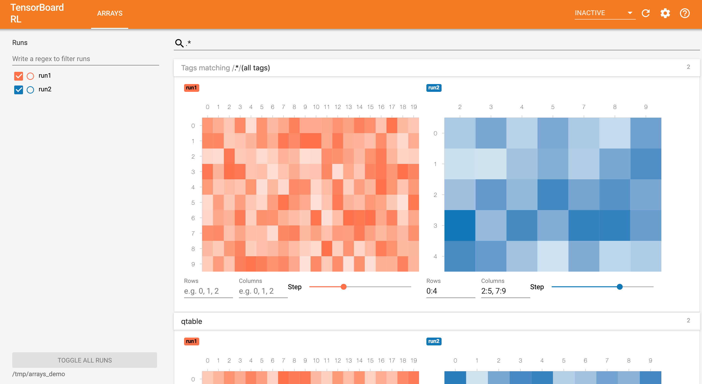

# TensorBoard RL

An extension of TensorBoard that includes a suite of plugins for reinforcement
learning.

Currently, this only includes a plugin called Matrices, which lets you visualize
arbitrary 2D tensors as a heat map.

## Usage

For a demo of the Matrices plugin, run

```
bazel run //matrices_dashboard:matrices_demo
```

from the project's root directory. This will create some TensorFlow event files
in the directory `/tmp/matrices_demo` that we can visualize.

Next, launch TensorBoard using

```
bazel run //tensorboard_rl -- --logdir=/tmp/matrices_demo
```

Finally, navigate to `localhost:6006` in your browser to see the demo!

## Preview


